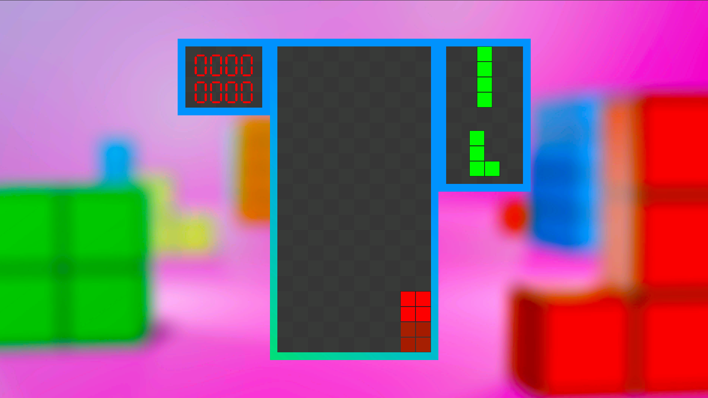
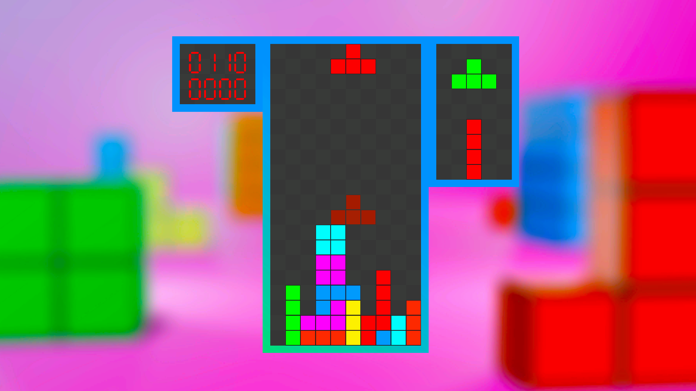
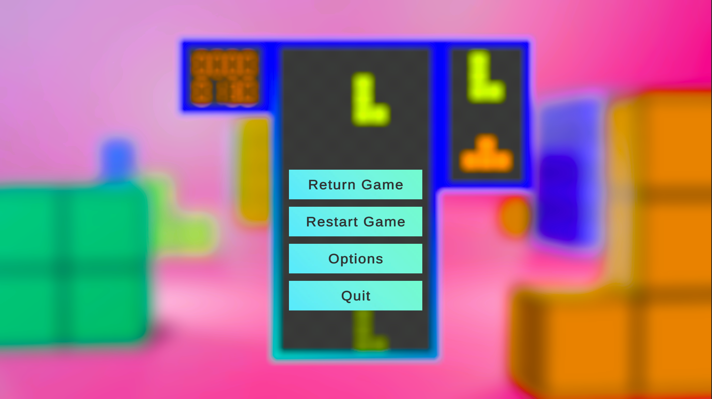
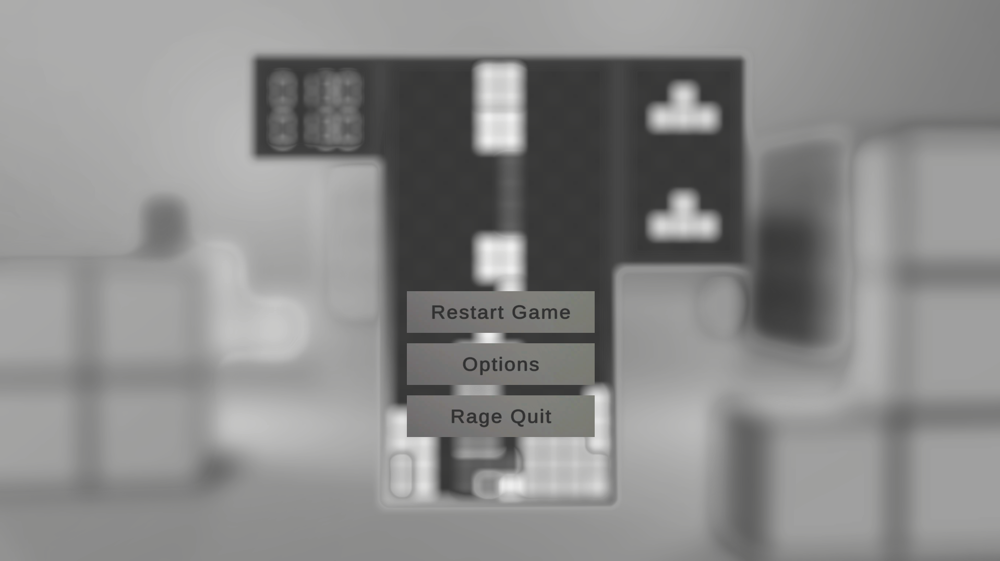

# StoneFall
**StoneFall**, Unity oyun motoru kullanılarak geliştirilmiş bir Tetris benzeri puzzle oyunudur**

## Gameplay
- Taşlar yukarıdan düşer ve oyuncu bu taşları uygun şekilde döndürerek yerleştirir.
- Bir satır tamamen dolduğunda o satırlar temizlenir ve oyuncuya puan kazandırır.
- Taşlar üst sınırı geçtiğinde oyun sona erer.

## Screenshots

### Gameplay

### Menu

### Gameover

